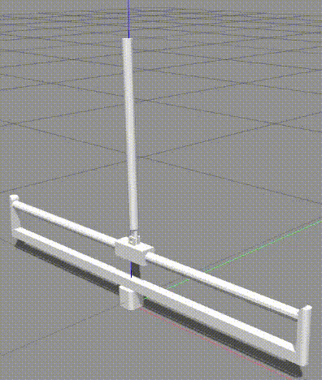

# ppo_gazebo_tf
Reinforcement Learning for solving the custom **cartpole** balance problem in **gazebo environment** using **Proximal Policy Optimization(PPO)**.

### Environment
- Custom cartpole in gazebo (similar to the one from OpenAI gym)
- Observation Space: 4 (continuos)
- Action Space: 2 (discrete) 
- Reward range: 

### Dependencies

- <a href="http://releases.ubuntu.com/16.04/">Ubuntu 16.04</a> 
- <a href="http://wiki.ros.org/kinetic">ROS Kinetic</a> 
- <a href="http://gazebosim.org/">Gazebo 7</a> 
- <a href="https://www.tensorflow.org/">TensorFlow: 1.1.0</a> 
- <a href="https://github.com/openai/gym">gym: 0.9.3</a> 
- Python 3.6

### File setup:
- **cartpole_gazebo** contains the robot model(both **.stl** files & **.urdf** file) and also the ***gazebo launch file***.

- **cartpole_controller** contains the reinforcement learning implementation of ****Proximal Policy Optimization(PPO)**** for custom cartpole environment.

### Training Phase:
```
python3 ppo_train.py
```
<p align= "center">
  
</p>

### Testing trained policy:
```
python3 ppo_test.py
```
### References:
- <b><a href="https://blog.openai.com/openai-baselines-ppo/">Proximal Policy Optimization by OpenAI</a></b> 
- <b><a href="https://github.com/uidilr/ppo_tf">PPO implementation using TensorFlow</a></b>

### TODO:
- Use Tensorboard for plotting the training and testing graphs. 

## Project collaborator(s): 
**<a href="https://github.com/ioarun">Arun Kumar</a>** (arunkumar12@iisc.ac.in)


