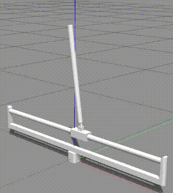

# ppo_gazebo_tf
Reinforcement Learning for solving the custom **cartpole** balance problem in **gazebo environment** using **Proximal Policy Optimization(PPO)**.

### Environment
- Custom cartpole environment(from OpenAI gym) in gazebo. 
- Observation Space: 4 (continuos)
- Action Space: 2 (discrete) 
- Reward range: 

### Dependencies

- Ubuntu 16.04 (http://releases.ubuntu.com/16.04/)
- ROS Kinetic (http://wiki.ros.org/kinetic)
- Gazebo 7 (http://gazebosim.org/)
- TensorFlow: 1.1.0 (https://www.tensorflow.org/) [with GPU support] 
- gym: 0.9.3 (https://github.com/openai/gym)
- Python 3.6

### File setup:
- **cartpole_gazebo** contains the robot model(both **.stl** files & **.urdf** file) and also the ***gazebo launch file***.

- **cartpole_controller** contains the reinforcement learning implementation of ****Proximal Policy Optimization(PPO)**** for custom cartpole environment.

### Training Phase:

python3 ppo_train.py 

  

### Testing trained policy:

python3 ppo_test.py

### References:
- Proximal Policy Optimization by OpenAI: https://blog.openai.com/openai-baselines-ppo/
- PPO implementation using TensorFlow: https://github.com/uidilr/ppo_tf

### TODO:
- Use Tensorboard for plotting the training and testing graphs. 

## Project collaborator(s): 
**Arun Kumar** (https://github.com/ioarun)

